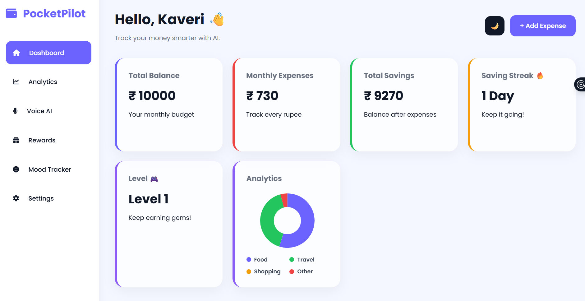
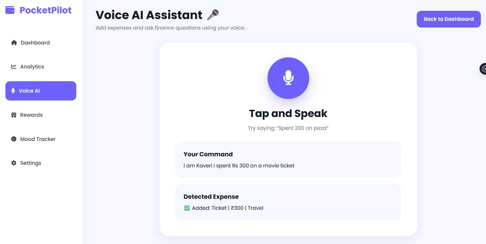
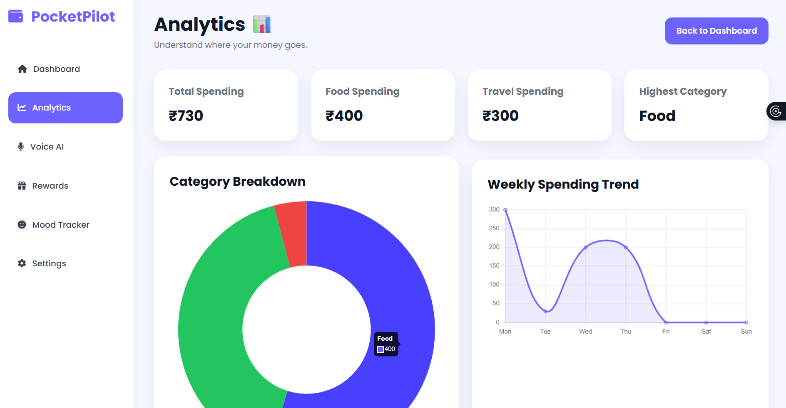
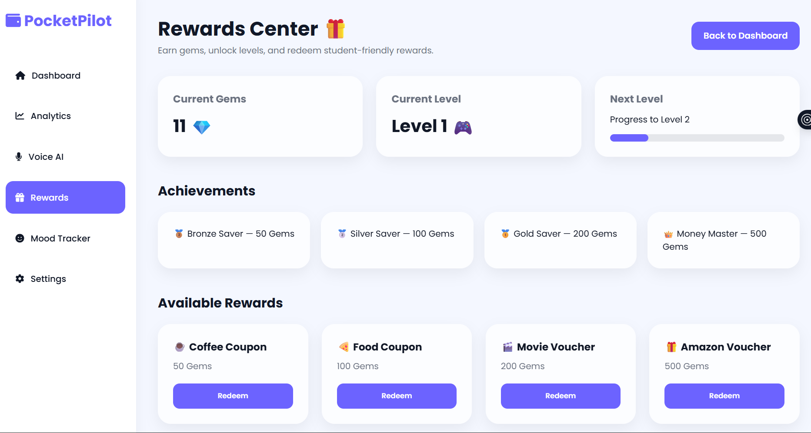
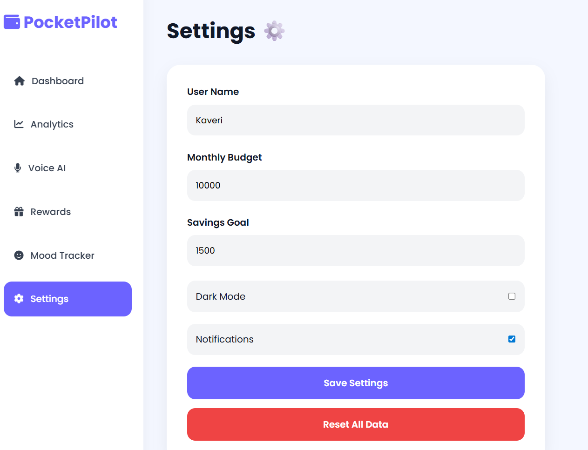

# PocketPilot 🧭

**PocketPilot** is a full-stack, AI-powered personal finance operating system tailored for students. It simplifies expense tracking with Voice AI, tracks emotional spending triggers, reinforces savings through gamification (gems, streaks, levels), and delivers actionable financial coaching via Groq Llama 3.3.

---

## 🚀 Key Features

- **🔐 User Authentication**: JWT-based secure signup & login with bcrypt password encryption + instant Guest / Demo mode.
- **🎙️ Voice AI Assistant**: Hands-free expense logging using Web Speech Recognition and smart NLP keyword extraction.
- **🧠 AI Financial Coach**: Personalized, 3-point daily financial insights powered by Groq Cloud (`llama-3.3-70b-versatile`).
- **🎮 Gamified Rewards**: Earn gems on every spend, maintain daily active streaks, and level up to unlock student coupons.
- **😊 Mood-Based Spending Tracker**: Tag transactions with moods (Happy, Stressed, Bored, Sad) to detect emotional spending habits.
- **📊 Real-Time Analytics**: Interactive Chart.js category doughnut breakdowns and date-calculated weekly spending trends.
- **🔔 Smart Alerts & Budget Limits**: Automatic threshold warnings when approaching food/travel category limits.
- **🌓 Theme Persistence**: Light & Dark mode support across all screens with local storage sync.
- **🗑️ Full CRUD Control**: Create, view, and delete expenses directly with instant UI updates.

---

## 🛠️ Tech Stack

### Frontend
- **HTML5 & CSS3**: Responsive UI with custom design system tokens
- **Vanilla JavaScript (ES6+)**: Centralized API client & state management
- **Chart.js**: Dynamic charts for category and weekly spending trends
- **Web Speech API**: Browser-native voice command processing
- **FontAwesome 6.5**: Modern icon set

### Backend
- **Node.js & Express.js (v5)**: Modular REST API
- **MongoDB Atlas & Mongoose**: Cloud document database with User and Expense schemas
- **JSON Web Tokens (JWT) & bcryptjs**: Secure authentication and authorization
- **Groq SDK**: High-speed LLM inference (`llama-3.3-70b-versatile`)
- **CORS & Dotenv**: Cross-origin resource sharing and environment management

---

## 📡 API Endpoints

| Method | Endpoint | Description |
| :--- | :--- | :--- |
| `GET` | `/test` | Server health check |
| `POST` | `/api/auth/register` | Register a new student account |
| `POST` | `/api/auth/login` | Log in and receive JWT token |
| `POST` | `/api/auth/guest` | Initialize a demo/guest session |
| `GET` | `/api/auth/me` | Fetch authenticated user details |
| `GET` | `/api/expenses` | Retrieve all expenses (sorted by date) |
| `POST` | `/api/expenses` | Add a new expense & calculate gem/streak rewards |
| `PUT` | `/api/expenses/:id` | Update an existing expense |
| `DELETE`| `/api/expenses/:id` | Delete a single expense |
| `DELETE`| `/api/expenses` | Clear user expenses |
| `GET` | `/api/user` | Get profile, gems, streak, and level |
| `PUT` | `/api/user/profile` | Update profile, budget, and savings goal |
| `DELETE`| `/api/user/reset` | Reset all user data & streaks |
| `GET` | `/api/ai/insights` | Fetch Groq AI financial recommendations |

---

## ⚙️ Quickstart & Installation

### 1. Clone Repository
```bash
git clone https://github.com/KaveriJadhao/PocketPilot.git
cd PocketPilot
```

### 2. Configure Backend
```bash
cd Backend
npm install
```

### 3. Set Up Environment Variables
Create a `.env` file in the `Backend/` folder:
```env
MONGO_URI=your_mongodb_connection_string
GROQ_API_KEY=your_groq_api_key
JWT_SECRET=your_jwt_secret_key
PORT=5000
```
*(Reference `Backend/.env.example` for defaults)*

### 4. Start Server
```bash
# Start with nodemon (development)
npm run dev

# Or standard start
npm start
```

### 5. Launch Frontend
Open `Frontend/html/index.html` or `Frontend/html/dashboard.html` in your browser (or use VS Code Live Server).

---

## 📸 Screenshots

| Screen | Preview |
| :--- | :--- |
| **Landing Page** | `Frontend/html/index.html` |
| **Dashboard** |  |
| **Voice AI** |  |
| **Analytics** |  |
| **Rewards** |  |
| **Settings** |  |

---

## 👩‍💻 Author

**Kaveri Jadhao**  
*Computer Science & Engineering Student*  
GitHub: [@KaveriJadhao](https://github.com/KaveriJadhao)
