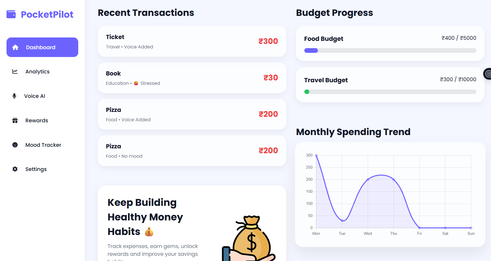
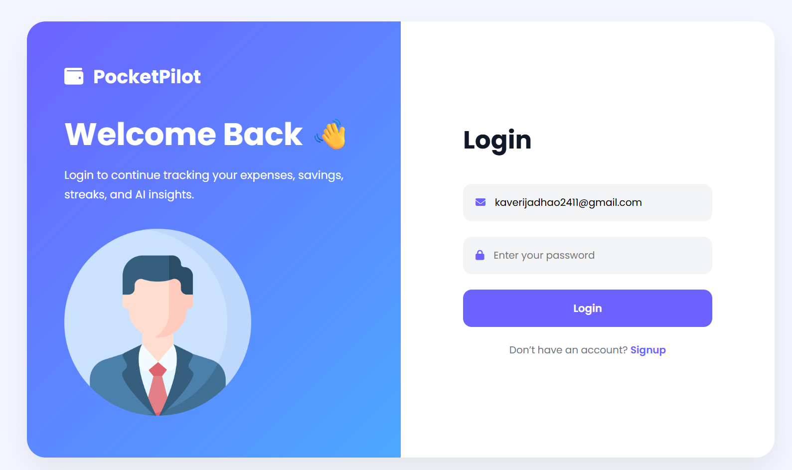

# 🧭 PocketPilot — Intelligent Student Finance OS

<div align="center">

  

  <h3>Simple, Smart & Gamified Expense Tracker for College Students</h3>

  <p>
    Track daily spending with your voice, manage monthly student budgets, detect emotional spending habits, and earn gamified rewards with AI-driven rupee tips.
  </p>

  <p>
    <a href="#-screenshots"></a>
    <a href="#-tech-stack"></a>
    <a href="#-ai-features"></a>
    <a href="#-license"></a>
  </p>

</div>

---

## 📖 Table of Contents
- [✨ Key Features](#-key-features)
- [📸 Screenshots & Visual Tour](#-screenshots--visual-tour)
- [🛠️ Tech Stack & Architecture](#️-tech-stack--architecture)
- [📡 API Documentation](#-api-documentation)
- [🚀 Quick Start & Installation](#-quick-start--installation)
- [🛡️ Zero-Failure Offline Fallback](#️-zero-failure-offline-fallback)
- [👩‍💻 Author & Credits](#-author--credits)

---

## ✨ Key Features

### 🎙️ 1. Voice AI Expense Logger
- Hands-free voice expense logging powered by the native browser **Web Speech API**.
- Smart natural language processing extracts the **item name**, **amount in ₹**, **category**, and **mood** in real-time.
- Audio and speech synthesis confirmation feedback (*e.g., "Saved ₹120 for Canteen Lunch"*).

### 📊 2. Live Student Budget Cockpit
- Real-time calculations of **Monthly Budget**, **Total Spent**, **Money Left to Spend**, and **Estimated Month Spend**.
- Visual progress bar that dynamically indicates budget health with color-coded safety zones.
- Interactive Chart.js visualizations for category share and weekly spending trends.

### 😊 3. Mood & Behavioral Spending Intelligence
- Tag expenses with emotional states: **Happy**, **Stressed**, **Bored**, or **Sad**.
- Behavioral analytics track emotional spending triggers to help students curb impulsive purchases.

### 🎮 4. Gamification & Student Rewards Hub
- Daily active login & logging streak counter with fire badges.
- Earn **Gems** on every logged transaction and level up through Student Tiers (*Bronze, Silver, Gold*).
- Redeem earned gems for real student discount vouchers on food, campus coffee, and study books.

### 🔐 5. Secure Authentication & Instant Demo
- User registration and login protected with **JSON Web Tokens (JWT)** and **bcryptjs** password hashing.
- Interactive password show/hide eye toggles.
- **One-Tap Guest Mode** allowing instant demo access without mandatory signup.

### 🌓 6. Swiss Sapphire Design & Dark Theme
- Modern, clean aesthetic built with custom design tokens and fluid typography (*Plus Jakarta Sans*).
- 100% mobile-responsive across 320px to 1920px viewports with custom dual-view table feeds.
- Seamless Dark / Light theme toggle with local storage persistence.

---

## 📸 Screenshots & Visual Tour

### 🧭 Overview Dashboard
> *Your central financial cockpit with real-time budget cards, charts, smart AI tips, and recent expenses.*

<div align="center">
  
</div>

<br/>

<div align="center">
  
</div>

---

### 🎙️ Voice AI Assistant & 📈 Spending Analytics

| 🎙️ Hands-Free Voice AI Logger | 📈 Deep Category Analytics |
| :---: | :---: |
|  |  |
| *Real-time speech transcription, detected HUD, and 1-tap logging.* | *Detailed spend table, category share, and budget variance gauges.* |

---

### 🎁 Gamified Rewards Hub & 💓 Mood Patterns

| 🎁 Rewards, Streaks & Coupons | 💓 Mood-Based Spending Patterns |
| :---: | :---: |
|  |  |
| *Level progress, earned gems, and unlockable student discounts.* | *Behavioral spending habits and emotional impulse insights.* |

---

### 🔐 Authentication & ⚙️ Profile Settings

| 🔐 Sign In Page | ⚙️ Settings Console |
| :---: | :---: |
|  |  |
| *Clean Swiss design, password toggle, and guest demo option.* | *Profile customization, monthly budget limits, and data export.* |

---

## 🛠️ Tech Stack & Architecture

```
┌─────────────────────────────────────────────────────────────┐
│                    PocketPilot Frontend                     │
│  HTML5 • Vanilla JS (ES6+) • CSS3 Tokens • Chart.js • Icons │
└──────────────────────────────┬──────────────────────────────┘
                               │ HTTP / JSON / JWT
┌──────────────────────────────▼──────────────────────────────┐
│                    Node.js & Express API                    │
│      Auth Routes • Expense CRUD • AI Engine • Middleware    │
└──────────────┬───────────────────────────────┬──────────────┘
               │                               │
┌──────────────▼──────────────┐ ┌──────────────▼──────────────┐
│   MongoDB Atlas / Mongoose  │ │     Groq Cloud AI API       │
│  (Cloud Database / Schemas) │ │ (Llama 3.3 Versatile Model) │
└──────────────┬──────────────┘ └──────────────┬──────────────┘
               │                               │
┌──────────────▼───────────────────────────────▼──────────────┐
│             Resilient Local Fallback Engine                 │
│  JSON File Store (db.json) • Rule-Based AI Spending Engine  │
└─────────────────────────────────────────────────────────────┘
```

### Frontend
- **HTML5 & CSS3 Variables**: Modular design system (`variables.css`, `typography.css`, `components.css`, `sidebar.css`, `layout.css`).
- **Vanilla JavaScript (ES6+)**: Centralized API manager and state client (`api.js`).
- **Chart.js**: Reactive doughnut and bar charts for category distribution and weekly trends.
- **Web Speech API**: Browser-native voice recognition for real-time transcription.
- **FontAwesome 6.5**: Modern icon library.

### Backend
- **Node.js & Express.js (v5)**: Fast RESTful routing and static file serving.
- **MongoDB Atlas & Mongoose**: Document store for User and Expense models.
- **JSON Web Tokens (JWT) & bcryptjs**: Stateless authentication and password security.
- **Groq SDK**: Ultra-fast LLM inference using `llama-3.3-70b-versatile`.
- **Local JSON Store (`storage.js`)**: Autonomous offline fallback database ensuring 100% uptime.

---

## 📡 API Documentation

### 🔐 Authentication (`/api/auth`)
| Method | Endpoint | Description |
| :--- | :--- | :--- |
| `POST` | `/api/auth/register` | Register a new student account (`name`, `email`, `password`, `monthlyBudget`, `savingsGoal`) |
| `POST` | `/api/auth/login` | Authenticate with email & password, returns JWT token |
| `POST` | `/api/auth/guest` | Generate an instant guest / demo session |
| `GET` | `/api/auth/me` | Fetch authenticated user information |

### 💸 Expense Management (`/api/expenses`)
| Method | Endpoint | Description |
| :--- | :--- | :--- |
| `GET` | `/api/expenses` | List all expenses for user (sorted by date) |
| `POST` | `/api/expenses` | Add a new expense, increment daily streak, and award gems |
| `GET` | `/api/expenses/:id` | Get details of a single expense |
| `DELETE` | `/api/expenses/:id` | Delete an expense and recalculate remaining balance |

### 👤 User Profile (`/api/user`)
| Method | Endpoint | Description |
| :--- | :--- | :--- |
| `GET` | `/api/user/profile` | Get user settings, budget, savings target, level, and gems |
| `PUT` | `/api/user/profile` | Update profile details (`name`, `monthlyBudget`, `savingsGoal`, `theme`) |
| `DELETE` | `/api/user/reset` | Clear all transactions and reset streak counter |

### 🧠 AI Financial Insights (`/api/ai`)
| Method | Endpoint | Description |
| :--- | :--- | :--- |
| `GET` | `/api/ai/insights` | Fetch 3-point AI financial advice generated from student spending |

---

## 🚀 Quick Start & Installation

### Prerequisites
- [Node.js](https://nodejs.org/) (v16 or higher)
- [Git](https://git-scm.com/)

### 1. Clone the Repository
```bash
git clone https://github.com/KaveriJadhao/PocketPilot.git
cd PocketPilot
```

### 2. Install Dependencies
```bash
npm install
```

### 3. Configure Environment Variables (Optional)
Create a `.env` file in the `Backend/` directory:
```env
PORT=5000
JWT_SECRET=your_super_secure_jwt_secret_key_2026
MONGO_URI=your_mongodb_connection_string # Optional (local fallback active)
GROQ_API_KEY=your_groq_api_key           # Optional (rule engine fallback active)
```
*(Reference `Backend/.env.example` for details)*

### 4. Start the Application
```bash
# Start backend server
node Backend/server.js

# Or start with live reload
npm run dev
```

### 5. Access in Browser
- 🏠 **Landing Page**: [http://localhost:5000/](http://localhost:5000/)
- 🧭 **Dashboard**: [http://localhost:5000/dashboard](http://localhost:5000/dashboard)

---

## 🛡️ Zero-Failure Offline Fallback

PocketPilot is architected to be resilient and fail-safe:

1. **Database Fallback**: If MongoDB connection is unavailable, the backend automatically redirects operations to a local JSON database file (`Backend/data/db.json`). All CRUD operations continue functioning smoothly.
2. **AI Fallback**: If an external Groq API key is not configured, the built-in heuristic analysis engine calculates the top spend category, dominant mood trigger, and custom rupee savings tips.
3. **Asset Fallback**: All user avatars and UI icons are local SVG vector assets, preventing external CDN failures.

---

## 👩‍💻 Author & Credits

Developed with ❤️ by **Kaveri Jadhao**  
*Computer Science & Engineering Student*

- 🐙 **GitHub**: [@KaveriJadhao](https://github.com/KaveriJadhao)
- 📁 **Repository**: [https://github.com/KaveriJadhao/PocketPilot](https://github.com/KaveriJadhao/PocketPilot)

---

## 📄 License

This project is licensed under the **ISC License**. Open-source and free for students.
